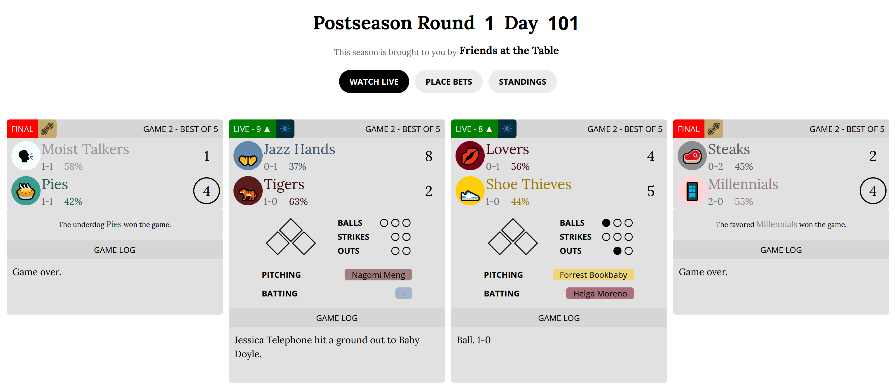

# Deprecated styles

Styles that are no longer being updated/supported are here in their final form.

### Blaseball light mode

**Discontinued:** Blaseball now includes a light mode!
Enable it with the _Light mode_ setting, which can be found by clicking
_Account Settings_ at the bottom of the page on the Blaseball site.

Just because the players live under the constant threat of the solar eclipse,
doesn't mean you have to! A light mode for the few of us who want it. Fully compatible
and tested with the [BIG SCREEN Blaseball](index.html#big-screen-blaseball) style for
big, light goodness.

Includes the [Windows 10 Emoji fix](index.html#emoji-fix).

There's a [changelog](changelog.html#blaseball-light-mode) for this style.

[Install Style](styles/blaseball-light-mode.user.css)
