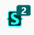
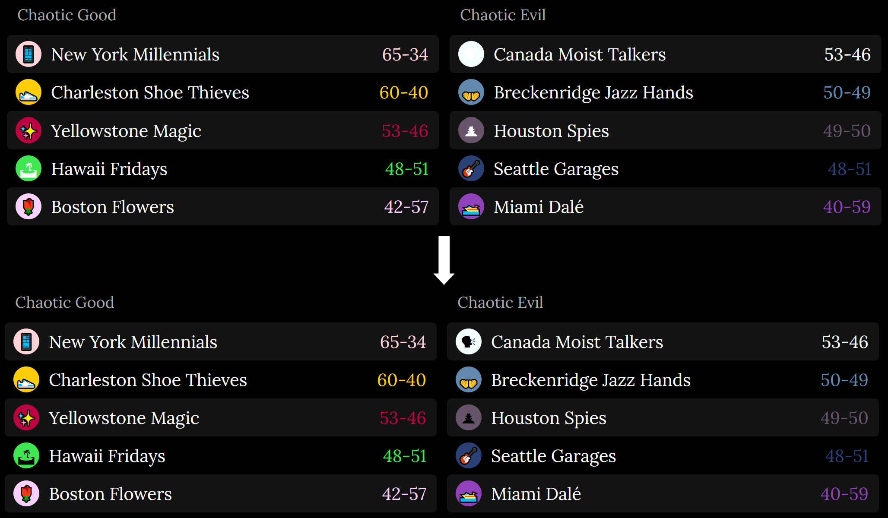
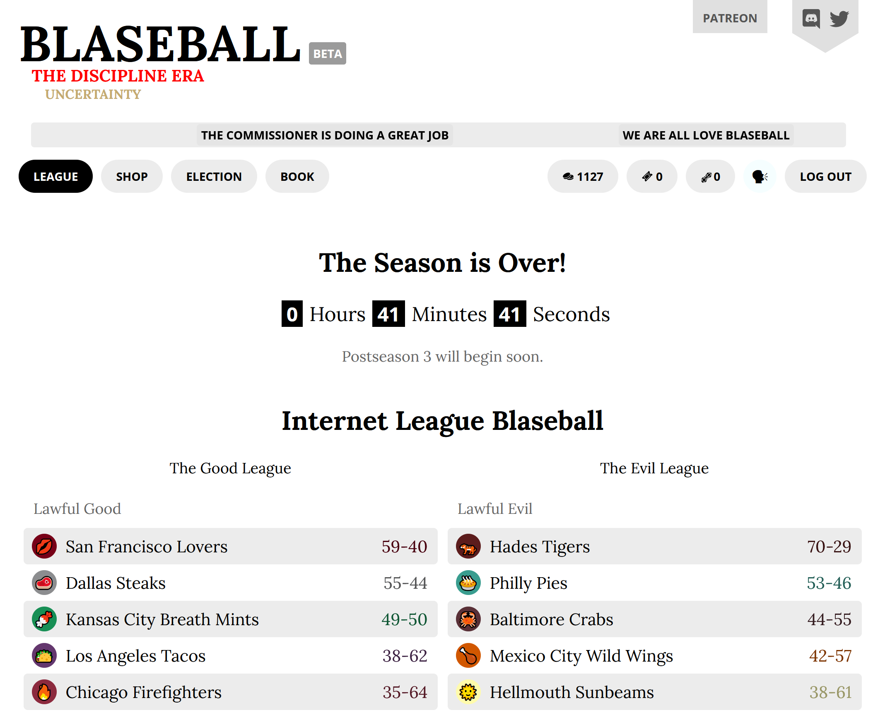
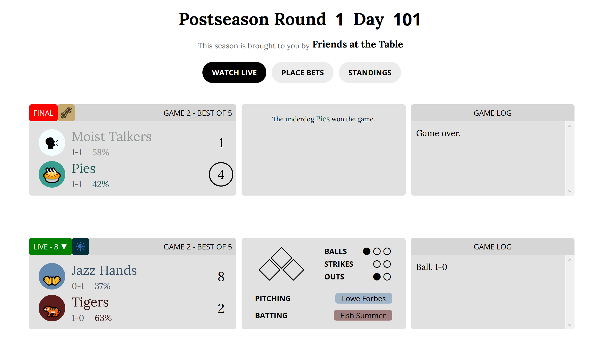
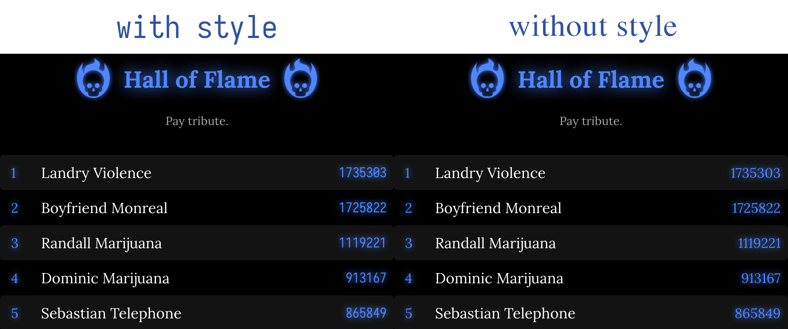

# Userstyle repository

**All styles should be considered in beta.** More styles may be added over time!
Please leave suggestions for new styles, or problems with existing styles,
as a [GitHub issue](https://github.com/holmesmr/Blaseball-Userstyles/issues).

**Note:** As Blaseball changes quite frequently, these styles might occasionally be
broken by game updates (siestas). Check/file [GitHub issues](https://github.com/holmesmr/Blaseball-Userstyles/issues)
if you encounter brokenness right after a siesta, and try checking the [changelog](changelog.html)
to see if recent fixes were applied. Check out the [manual update procedure](#updates)
to fix your styles afterwards.

## Instructions

* Install the Stylus extension for [Firefox](https://addons.mozilla.org/en-GB/firefox/addon/styl-us/) or [Chrome](https://chrome.google.com/webstore/detail/stylus/clngdbkpkpeebahjckkjfobafhncgmne).

* Find the Userstyle you want below.

* Click the Install Style link.

## Updates

Blaseball is a fast-moving game, and you'll need to update the styles sometimes after
siestas. Styles will update automatically from time to time, but to manually update a style:

* Look for the Stylus icon in your browser extension bar: 

* Click the button.

* Click Manage on the popup.

* In the sidebar in the Manage screen, click Check all styles for update.

* Once checked, click Install all updates, if available.

### Note for Chrome users

Your Stylus extension icon may be in the new _Extensions_ menu. If you don't see the
Stylus icon above:

* Look for the Extensions puzzle piece in your toolbar: 

* Click the three vertical dots icon next to Stylus in the dropdown.

* Choose 'Open style manager'.

* In the sidebar in the Manage screen, click Check all styles for update.

* Once checked, click Install all updates, if available.

## Styles

### BIG SCREEN Blaseball

See all the matches/bets on screen at once with this BIG SCREEN experience. 
Attempts to show matches 2 rows of 5.

You may need to lower the zoom on your browser if you have a smaller screen.

Includes the [Windows 10 Emoji fix](#windows-10-emoji-fix).

There's a [changelog](changelog.html#big-screen-blaseball) for this style.

[Install Style](styles/big-screen-blaseball.user.css)

### Windows 10 Emoji fix

Makes monochrome emojis used by the Moist Talkers, Spies and Fridays visible
by making them black (okay, the Spies is not really _more_ visible, but definitely
more fitting, at least!)

This is already included in the [BIG SCREEN Blaseball](#big-screen-blaseball)
and [light mode](#blaseball-light-mode) styles, it's only needed if you want to fix
this issue without the BIG SCREEN experience.

There's a [changelog](changelog.html#windows-10-emoji-fix) for this style.

[Install Style](styles/win10-emoji-fix.user.css)

### Blaseball light mode

Just because the players live under the constant threat of the solar eclipse,
doesn't mean you have to! A light mode for the few of us who want it. Fully compatible
and tested with the [BIG SCREEN Blaseball](#big-screen-blaseball) style for
big, light goodness.

Includes the [Windows 10 Emoji fix](#windows-10-emoji-fix).

There's a [changelog](changelog.html#blaseball-light-mode) for this style.

[Install Style](styles/blaseball-light-mode.user.css)

### Legible hall tables

Makes the tables in the Hall of Flame a little easier to read with a monospace font.

[Install Style](styles/legible-hall-tables.user.css)

----

A production of Cepheus (@ceph3us#0451) on the [Blaseball Discord](//discord.gg/3uFgJhu).

Go Moist Talkers!

 This work is licensed under a <a rel="license" href="http://creativecommons.org/licenses/by-sa/4.0/">Creative Commons Attribution-ShareAlike 4.0 International License</a>.
