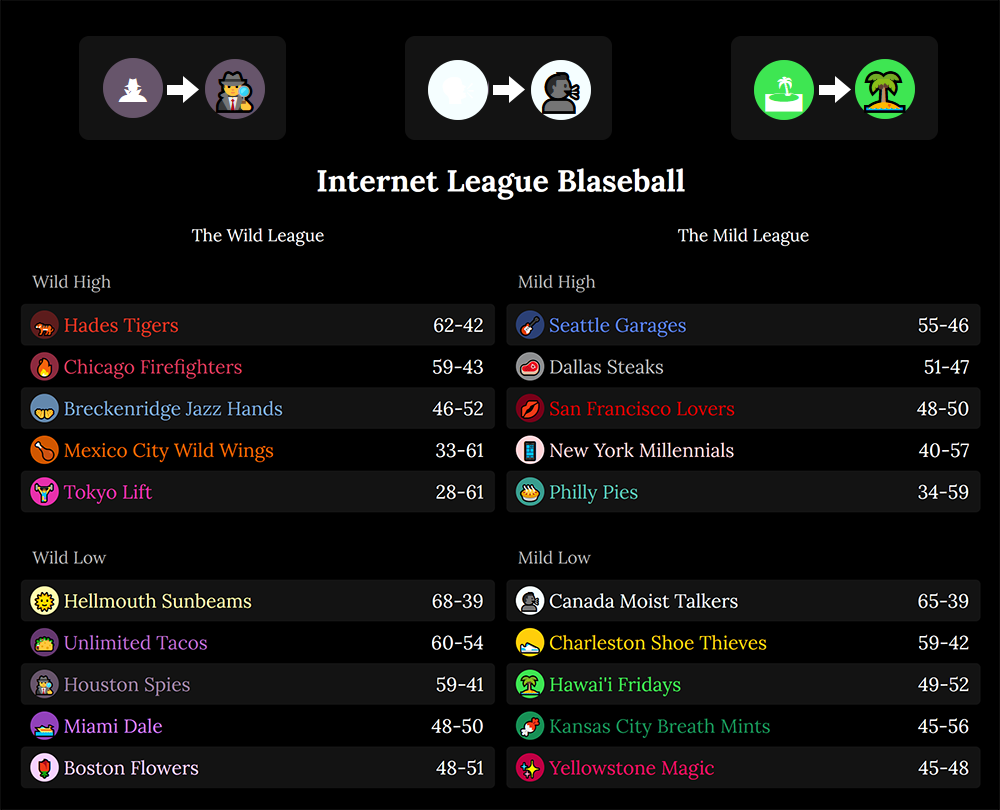

# Userstyle repository

**All styles should be considered in beta.** More styles may be added over time!
Please report problems with existing styles
as a [GitHub issue](https://github.com/holmesmr/Blaseball-Userstyles/issues).

For questions or suggestions for new styles, please use the
[discussion forum](https://github.com/holmesmr/Blaseball-Userstyles/discussions).

**Note:** As Blaseball changes quite frequently, these styles might occasionally be
broken by game updates (siestas). Check/file [GitHub issues](https://github.com/holmesmr/Blaseball-Userstyles/issues)
if you encounter brokenness right after a siesta, and try checking the [changelog](changelog.html)
to see if recent fixes were applied. Check out the [manual update procedure](#updates)
to fix your styles afterwards.

## Instructions

* Install the Stylus extension for [Firefox](https://addons.mozilla.org/en-GB/firefox/addon/styl-us/) or [Chrome](https://chrome.google.com/webstore/detail/stylus/clngdbkpkpeebahjckkjfobafhncgmne).

* Find the Userstyle you want below.

* Click the Install Style link.

## Updates

Blaseball is a fast-moving game, and you'll need to update the styles sometimes after
siestas. Styles will update automatically from time to time, but to manually update a style:

* Look for the Stylus icon in your browser extension bar: 

* Click the button.

* Click Manage on the popup.

* In the sidebar in the Manage screen, click Check all styles for update.

* Once checked, click Install all updates, if available.

### Note for Chrome users

Your Stylus extension icon may be in the new _Extensions_ menu. If you don't see the
Stylus icon above:

* Look for the Extensions puzzle piece in your toolbar: 

* Click the three vertical dots icon next to Stylus in the dropdown.

* Choose 'Open style manager'.

* In the sidebar in the Manage screen, click Check all styles for update.

* Once checked, click Install all updates, if available.

## Styles

### BIG SCREEN Blaseball

See all the matches/bets on screen at once with this BIG SCREEN experience. 
Attempts to show matches 2 rows of 5.

You may need to lower the zoom on your browser if you have a smaller screen.

Includes the [Emoji fix (previously Windows 10 Emoji fix)](#emoji-fix).

There's a [changelog](changelog.html#big-screen-blaseball) for this style.

Please report suggestions or feedback for BIG SCREEN Blaseball in the
[feedback thread on GitHub](https://github.com/holmesmr/Blaseball-Userstyles/discussions/10).

[Install Style](styles/big-screen-blaseball.user.css)

### Emoji fix (previously Windows 10 Emoji fix)

Ensures the emojis used for team logos are always using the colorised versions where
appropriate, and uses a generally more visible black for users without full emoji
support (e.g. Windows 7).

This is already included in the [BIG SCREEN Blaseball](#big-screen-blaseball) style, 
it's only needed if you want to fix this issue without the BIG SCREEN experience.

There's a [changelog](changelog.html#windows-10-emoji-fix) for this style.

Please report suggestions or feedback for the Emoji Fix in the
[feedback thread on GitHub](https://github.com/holmesmr/Blaseball-Userstyles/discussions/11).

[Install Style](styles/win10-emoji-fix.user.css)

### Additional thanks

Thanks to [rwiiebe](https://github.com/rwiiebe) for suggesting an improved fix for
emoji display.

Thanks to [fox8091](https://github.com/fox8091) for pointing out areas where the
emoji fix needed updating.

## Discontinued styles

Some styles have been made redundant by fixes or improvements made by the Blaseball
team, but will be noted here so users know they're officially no longer supported.

* [Blaseball light mode](discontinued.html#blaseball-light-mode)

  * Blaseball now includes it's own light mode! Enable it with the _Light mode_ setting,
    which can be found by clicking _Account Settings_ at the bottom of the page on
    the Blaseball site.

----

A production of Cepheus (@ceph3us#0451) on the [Blaseball Discord](//discord.gg/3uFgJhu).
Other contibutors have been noted as appropriate.

Go Moist Talkers!

 This work is licensed under a <a rel="license" href="http://creativecommons.org/licenses/by-sa/4.0/">Creative Commons Attribution-ShareAlike 4.0 International License</a>.
